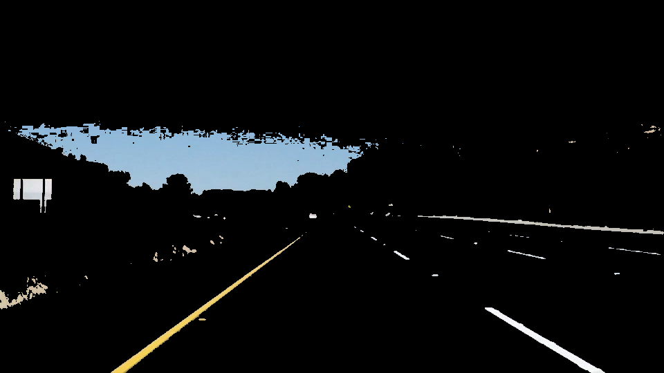
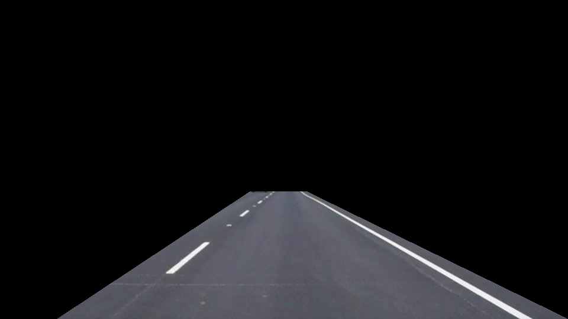
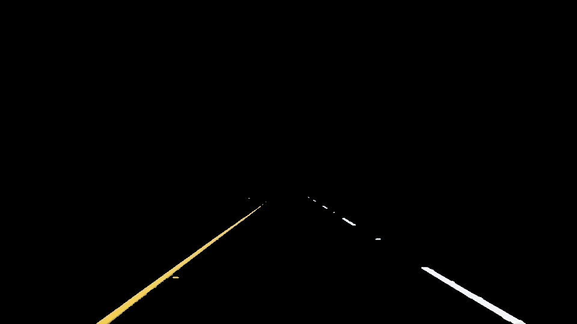
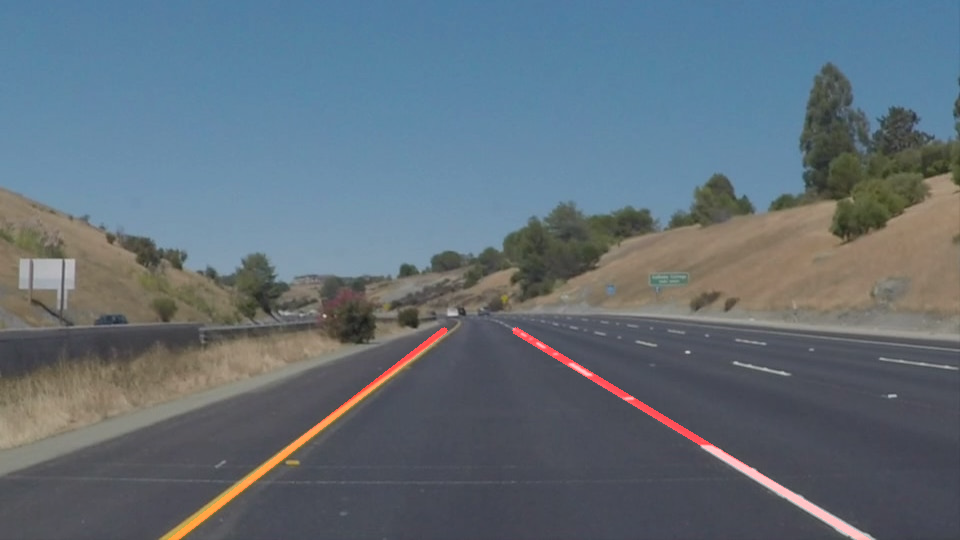

# **Finding Lane Lines on the Road** 

## **Overview**

This project detects lane lines in images using Python, OpenCV and basic Computer Vision Principles.  The project leverages some of the basic properties of Lane Lines to produce lines that overlay the Lane Line

### **Reflection**

The pipeline constructed leverages the shape, color, location and orientation of Lane Lines to locate them in the images.  The pipeline has the following stages

- Color Mask
- Region of Interest
- Edge Detection
- Line Overlay

    
#### Color Mask

First property of focus was color.  The test images have both white and yellow lane lines.  The Color Mask stage of the pipeline transforms the image to [Hue, Saturation Lightness Color Space(HSL/HLS)](https://en.wikipedia.org/wiki/HSL_and_HSV) and the image is filtered for yellow and white colors.  HSL space is used as it yield good results with dealing with the color contrast of the image.  The image was filtered for white and yellow separtely and then those two images were combined to yield the results below.

     
<figure>
 
</figure>

#### Region of Interest
Lanes detection has the natural property of being isolated to a specific region of the image as shown below.

<figure>
 
</figure>

The Region on Interest Stage applies a geometric mask to the Color Mask yielding the results below.

<figure>
 
</figure>

#### Canny Edge Detection

Shape is another strong property of lane lines.  Canny Edge Detection is then applied to the image to locate line in image.  In this stage the image is converted to gray scale and Gaussian blur is applied for smoothing the lines prior to applying the Canny filter

<figure>
 
</figure>

#### Line Line Overlay

To produce the Lane Line overlay, The correct lines produced by the Canny Edge Detection needed to be selected.  One other property of lane lines is their general orientation in the image.  Hough Transform is applied to the image to produce a series of points(slope and y intercept).  Processing is done on that data set(described below) to produce an overlay on the original image as shown below.
<figure>
 
</figure>

### Drawing Lane Line Overlay

The end goal is to recreate a path based on lane markings... To produce the Lane Lines, we do the following:

1. Lines are separated to the left and right line by assuming a mid point in the lane
2. Transform the Canny Lane Line Segments to Hough Space.  This gives us a series of points that represent the slope and y-intercept
3. Run a linear regression on the slope values to find an average
4. Given the slope, and points, which happened to be at the edges of the region of interest, a full line segment is drawn

### Identify potential shortcomings with your current pipeline

Pipeline is built on the crude assumptions(color, shape, location).  These are very good starting points, but have enough variation that can throw things off very easily.

- For example lane lines are not always yellow and white.
- There are also potential issues with color detection during different weather conditions and times(day/night) to consider.
- Lane Lines also curve.  Using the line fitting technique will not work very well when considering the average slope of the whole lane line.
- There could be other lines in the middle of the lane lines with any orientation.  

### Possible improvements to your pipeline

- Use different techniques for translating detected line points to line drawing.  There could be different polygons and/or curve fitting techniques to apply to that data set.
- Explore different color detection adverse conditions.  Switching color spaces provided a means to manage contrast in these images.  There could be other conditions where this approach doesn't work well
- Be smart about which elements of the image to process.  Much of the processing in this project was done on the whole image.  This is not necessary for purely line detection. Being that this is a real time system, doing expensive computations will eat into your response time budget.  
